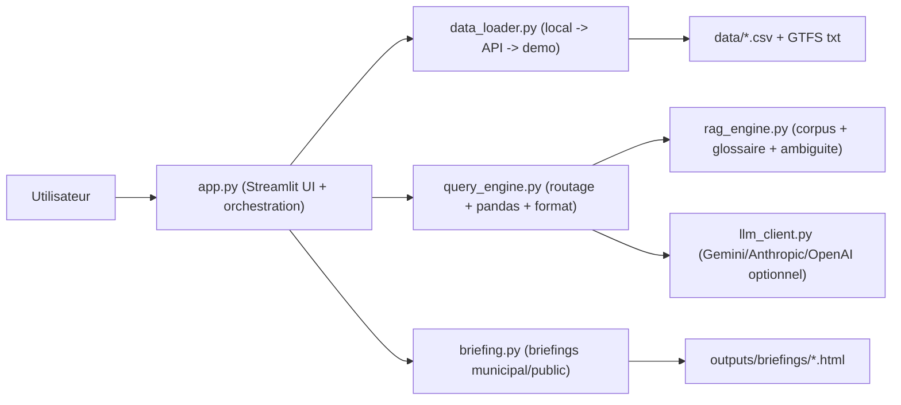

# Mobility Copilot - Montreal

Copilote analytique Streamlit pour la mobilite montrealaise, construit pour un usage decisionnel (jury hackathon, municipalite, lecture citoyenne), avec:
- chat analytique data-grounded,
- dashboard de pilotage,
- briefing automatique en deux modes (Grand public / Municipalite),
- garde-fous anti-hallucination et traçabilite complete.

---

## Table des matieres

1. [Vision et objectifs](#vision-et-objectifs)
2. [Ce que fait lapplication](#ce-que-fait-lapplication)
3. [Architecture de la solution](#architecture-de-la-solution)
4. [Description module par module](#description-module-par-module)
5. [Sources de donnees et strategie de chargement](#sources-de-donnees-et-strategie-de-chargement)
6. [Pipeline de reponse analytique](#pipeline-de-reponse-analytique)
7. [Fiabilite, anti-hallucination et traçabilite](#fiabilite-anti-hallucination-et-traçabilite)
8. [Installation et lancement](#installation-et-lancement)
9. [Configuration LLM (Gemini / Anthropic / OpenAI)](#configuration-llm-gemini--anthropic--openai)
10. [Utilisation (chat, dashboard, briefing)](#utilisation-chat-dashboard-briefing)
11. [Historique des evolutions majeures](#historique-des-evolutions-majeures)
12. [Troubleshooting (Mac / Windows)](#troubleshooting-mac--windows)
13. [Checklist demo / jury](#checklist-demo--jury)
14. [Limites connues](#limites-connues)
15. [Roadmap](#roadmap)
16. [Structure du repository](#structure-du-repository)

---

## Vision et objectifs

### Probleme adresse
Les donnees de mobilite (collisions, 311, meteo, STM) sont utiles mais:
- dispersees,
- heterogenes,
- difficiles a convertir rapidement en decisions actionnables.

### Objectif du projet
Fournir un copilote qui:
- comprend des questions en langage naturel,
- execute de vraies analyses pandas (pas d'invention de chiffres),
- expose clairement methode, preuves et limites,
- adapte le rendu selon le public cible (citoyen vs operationnel).

### Objectifs techniques choisis
1. Robustesse de calcul (execution reelle pandas).
2. Transparence methodologique (sources/filtres/requete/preuves).
3. Garde-fous anti-hallucination (RAG + statuts de fiabilite).
4. UX decisionnelle (resultat d'abord, methode ensuite).
5. Resilience (fallback donnees, fallback LLM, cross-platform).

---

## Ce que fait lapplication

### 1) Chat analytique
- Questions libres sur collisions, 311, STM, meteo.
- Routage automatique vers des analyses cibles:
  - `hotspots`,
  - `hotspots_meteo`,
  - `trend_incidents`,
  - `311_types_weather`,
  - `311_temperature`,
  - `quartiers`, `quartiers_meteo`,
  - `stm`.
- Gestion de l'ambiguite:
  - question trop vague -> options d'affinage cliquables,
  - question hors perimetre -> reponse de cadrage.
- Reponse structuree:
  - resultat cle,
  - eventuelle synthese LLM,
  - tableau/graphique principal,
  - methode repliable,
  - synthese locale orientee action.

### 2) Dashboard
- Insight principal en tete.
- KPI clefs (collisions, collisions graves, requetes 311, contexte dominant).
- Carte de densite collisions + top zones a surveiller.
- Sections secondaires repliables (lecture progressive).
- Bandeau explicite sur les analyses correlationnelles (causalite non demontree).

### 3) Briefing automatique
- Deux lectures sur le meme socle data:
  - **Municipalite**: vocabulaire operationnel, actions terrain.
  - **Grand public**: vocabulaire pedagogique, gestes de prevention.
- Sections hierarchisees:
  - zones prioritaires,
  - recommandations,
  - tendances/signaux,
  - sources/periode,
  - synthese orientee decision.
- Export snapshots HTML dans `outputs/briefings/`.

### 4) UX / UI
- Mode clair / mode sombre.
- Sidebar avec navigation, periode, statut des sources chargees.
- Hero central au premier affichage du chat.
- Input chat fixe en bas pendant la conversation.

---

## Architecture de la solution



Principe cle:
- `query_engine.py` est la couche analytique de verite.
- Le LLM ne remplace pas le calcul; il reformule/synthetise.
- La methode est toujours accessible pour audit.

---

## Description module par module

### `/Users/rupithan/Desktop/HACKATHON/app.py`
Role:
- point d'entree Streamlit;
- orchestration des 3 vues;
- gestion session state (page, theme, periode, historique);
- rendering UI (header/sidebar/cards/chat).

Responsabilites cle:
- appelle `get_data()` puis `get_engines(...)`;
- envoie les questions au moteur analytique;
- gere l'ambiguite interactive;
- applique les reglages de periode globaux.

### `/Users/rupithan/Desktop/HACKATHON/query_engine.py`
Role:
- coeur du systeme de Q/R analytique.

Responsabilites cle:
- detection d'intention (`route_question`);
- execution pandas reelle des analyses;
- fallback intelligent en cas de vide;
- generation de la reponse HTML structuree:
  - badge statut,
  - resultat cle,
  - synthese LLM (si disponible),
  - visualisation principale,
  - methode repliable,
  - synthese locale.

Correctif critique recent:
- suppression d'un double filtrage sur `trend_incidents` qui pouvait produire des pourcentages aberrants.

### `/Users/rupithan/Desktop/HACKATHON/rag_engine.py`
Role:
- corpus local RAG pour standardiser les termes et limiter les hallucinations.

Responsabilites cle:
- descriptions datasets;
- glossaire champs/categories;
- retrieval contexte;
- detection d'ambiguite semantique.

### `/Users/rupithan/Desktop/HACKATHON/briefing.py`
Role:
- generation des briefings automatiques.

Responsabilites cle:
- calcul KPI et tendances;
- rendu Grand public / Municipalite;
- statut de fiabilite briefing;
- mise en forme sections decisionnelles;
- export snapshot HTML.

### `/Users/rupithan/Desktop/HACKATHON/data_loader.py`
Role:
- ingestion resiliente des donnees.

Strategie:
1. lecture locale,
2. fallback API,
3. fallback demo.

Responsabilites cle:
- normalisation minimale des colonnes;
- mapping utile au moteur analytique;
- production d'un `status` par source (affiche dans la sidebar).

### `/Users/rupithan/Desktop/HACKATHON/llm_client.py`
Role:
- couche unique d'appel LLM.

Support:
- Gemini,
- Anthropic,
- OpenAI.

Responsabilites cle:
- lecture `.env`,
- appel API avec timeout,
- fallback et messages d'erreur propres,
- `status_line()` affichee dans l'UI.

### Utilitaires
- `/Users/rupithan/Desktop/HACKATHON/download_data.py`: telechargement datasets.
- `/Users/rupithan/Desktop/HACKATHON/diagnostic.py`: diagnostic rapide fichiers/colonnes.

---

## Sources de donnees et strategie de chargement

### Sources visees
- Requetes 311 (Ville de Montreal).
- Collisions routieres (donnees geolocalisees).
- STM GTFS (`stops.txt`, `routes.txt`).
- Meteo Canada (GeoMet climate-daily).

### Dossier attendu
`/Users/rupithan/Desktop/HACKATHON/data/`
- `311.csv`
- `collisions.csv`
- `meteo.csv`
- `routes.txt`
- `stops.txt`

Notes:
- ces fichiers sont ignores par git (pas pushes).
- l'app reste utilisable sans fichiers complets grace aux fallbacks.

---

## Pipeline de reponse analytique

1. Question utilisateur.
2. Verification perimetre:
   - smalltalk / hors sujet / trop vague.
3. RAG:
   - contexte de definitions,
   - detection ambiguite.
4. Selection analyse (`route_question`).
5. Filtrage periode + meteo.
6. Execution pandas.
7. Fallbacks si resultat vide:
   - assouplissement filtre meteo,
   - elargissement fenetre (jusqu'a 12 mois),
   - diagnostic global de secours.
8. Composition reponse:
   - resultat cle,
   - visualisation,
   - methode,
   - limites,
   - decision possible.

---

## Fiabilite, anti-hallucination et traçabilite

### Badge de statut
- `Analyse verifiee`
- `Analyse partielle`
- `Donnees insuffisantes`

### Methode repliable "Voir la methode d'analyse"
Contient:
- periode analysee;
- sources RAG utilisees;
- filtres appliques;
- agregats + lignes de preuve;
- trace d'execution;
- requete pandas executee;
- limites et verification suivante.

### Regles anti-hallucination
- aucun chiffre sorti sans calcul pandas execute;
- en cas d'impossibilite, message explicite + piste d'affinage;
- distinction claire correlation vs causalite;
- suggestion de verification prioritaire.

---

## Installation et lancement

### Prerequis
- Python 3.10+ (recommande 3.11+)
- pip

### Setup
```bash
cd /Users/rupithan/Desktop/HACKATHON
python -m venv .venv
source .venv/bin/activate
pip install -r requirements.txt
```

### Lancer l'app
```bash
python -m streamlit run app.py
```

### Diagnostic data
```bash
python diagnostic.py
```

### Telechargement datasets
```bash
python download_data.py
```

---

## Configuration LLM (Gemini / Anthropic / OpenAI)

Sans cle API:
- le moteur analytique fonctionne quand meme;
- seule la couche de reformulation LLM est degradee.

Copier `.env.example` vers `.env`, puis choisir un provider.

### Exemple Gemini
```bash
GEMINI_API_KEY=...
LLM_PROVIDER=gemini
LLM_MODEL=gemini-2.5-flash-lite
LLM_TIMEOUT_SEC=12
```

### Exemple Anthropic
```bash
ANTHROPIC_API_KEY=...
LLM_PROVIDER=anthropic
LLM_MODEL=claude-3-5-sonnet-latest
LLM_TIMEOUT_SEC=12
```

### Exemple OpenAI
```bash
OPENAI_API_KEY=...
LLM_PROVIDER=openai
LLM_MODEL=gpt-4o-mini
LLM_TIMEOUT_SEC=12
```

L'etat runtime s'affiche dans la sidebar:
- `LLM · Gemini API (...)`
- `LLM · Claude API (...)`
- `LLM · OpenAI API (...)`
- ou `LLM · Désactivé`.

---

## Utilisation (chat, dashboard, briefing)

### Navigation
- `Chat analytique`
- `Dashboard`
- `Briefing`

### Periode
- `7 derniers jours`
- `30 derniers jours`
- `3 derniers mois`
- `12 derniers mois`
- `Plage personnalisee`

### Exemples de questions utiles
- `Ou ca coince en ce moment ?`
- `Les collisions baissent-elles sur 3 mois ?`
- `Quels types de requetes 311 augmentent quand il neige ?`
- `Autour de quels arrets STM observe-t-on le plus de collisions ?`
- `Quels quartiers sont les plus touches par pluie/neige ?`

### Comportements attendus
- question vague -> proposition d'affinage;
- question hors perimetre -> recadrage;
- peu de donnees -> assouplissement controle + mention explicite.

---

## Historique des evolutions majeures

### Phase A - Stabilisation initiale
- socle data + fallbacks;
- affichage etat des sources.

### Phase B - Correctifs periode
- periode enfin appliquee partout (chat/dashboard/briefing);
- ajout plage personnalisee.

### Phase C - Differenciation Grand public / Municipalite
- meme socle data;
- formulation/lecture differenciees.

### Phase D - Refonte UX chat
- question puis resultat;
- methode repliable;
- barre chat fixe;
- hero initial.

### Phase E - Ambiguite et questions floues
- clarifications cliquables;
- meilleure gestion des formulations orales.

### Phase F - Traçabilite et fiabilite
- badges de statut;
- traces d'execution detaillees;
- limites + decision possible.

### Phase G - Dashboard plus lisible
- insight principal;
- sections primaire/secondaire;
- meilleure lisibilite graphique.

### Phase H - Briefing orienté action
- sections repliables;
- synthese orientee decision mise en avant;
- clarifications correlationnelles.

### Phase I - Theming clair/sombre
- harmonisation contrastes;
- stabilisation navigation/theme.

### Phase J - LLM reel + fallback
- support multi-provider;
- fonctionnement degrade propre.

### Phase K - Robustesse Windows/Mac
- correctifs compatibilite plotly/sidebar.

### Phase L - Coherence meteo apres clarification
- conservation explicite des termes meteo (neige/pluie/verglas) dans les raffinements.

### Phase M - Correctif tendance 3 mois
- suppression du double filtrage qui gonflait artificiellement les pourcentages.

---

## Troubleshooting (Mac / Windows)

### 1) Sidebar qui ne se rouvre pas (Windows)
- verifier version Streamlit;
- tester zoom navigateur 100%;
- rafraichir page + reset layout;
- mettre a jour Streamlit si possible.

### 2) Erreur Plotly type `colorbar.titlefont`
- vient d'incompatibilites de version Plotly;
- mettre a jour Plotly/Streamlit dans l'environnement.

### 3) Reponse incoherente
- ouvrir "Voir la methode d'analyse";
- verifier filtres et periode;
- verifier si fallback est active (meteo assouplie, fenetre elargie).

### 4) LLM indisponible
- verifier API key;
- verifier `LLM_PROVIDER` et `LLM_MODEL`;
- sinon l'app bascule sur le mode analytique local.

---

## Checklist demo / jury

1. Lancer l'app.
2. Verifier sidebar:
   - sources chargees,
   - statut LLM.
3. Tester une question claire (resultat + methode).
4. Tester une question vague (clarification).
5. Tester une question hors perimetre (refus propre).
6. Changer la periode -> verifier impact sur les 3 vues.
7. Basculer Grand public / Municipalite.
8. Montrer le bloc "Synthese orientee decision".

---

## Limites connues

- Certaines analyses restent descriptives (correlation != causalite).
- Certains classements sont en volumes bruts non normalises (population, trafic, longueur voirie).
- Desynchronisation temporelle possible entre sources (selon fraicheur jeux de donnees).
- Relation STM-collisions basee sur une approximation spatiale grille (pas geospatial buffer fin).

---

## Roadmap

1. Normalisation avancee des indicateurs.
2. Jointures geospatiales plus fines (buffers).
3. Version anglaise complete (UI + prompts + labels).
4. Suite de tests automatiques (unitaires + non-regression UX).
5. Observabilite LLM (latence, erreurs, taux fallback).

---

## Structure du repository

```text
/Users/rupithan/Desktop/HACKATHON
├── app.py
├── briefing.py
├── data_loader.py
├── diagnostic.py
├── download_data.py
├── llm_client.py
├── query_engine.py
├── rag_engine.py
├── requirements.txt
├── .env.example
├── .gitignore
├── DOCUMENTATION_EVOLUTION_COMPLETE.md
├── PRESENTATION_PPT_DEMO_COMPLETE.md
├── data/
│   ├── 311.csv
│   ├── collisions.csv
│   ├── meteo.csv
│   ├── routes.txt
│   └── stops.txt
└── outputs/
    └── briefings/
```

---

## Documents complementaires

- Evolution complete des changements:
  - `/Users/rupithan/Desktop/HACKATHON/DOCUMENTATION_EVOLUTION_COMPLETE.md`
- Support presentation et script demo:
  - `/Users/rupithan/Desktop/HACKATHON/PRESENTATION_PPT_DEMO_COMPLETE.md`

---

## Contexte

Projet realise dans le cadre d'un hackathon IA (Montreal, 2026).
Les donnees restent soumises aux licences de leurs plateformes source.
